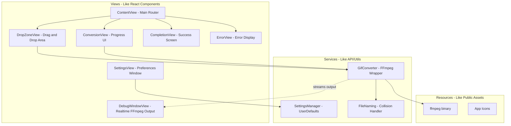

# Video to GIF - Native macOS App

## Web Dev Analogies (Reference Guide)

Before we dive in, here's how Swift/macOS concepts map to web development:| macOS/Swift | Web Development ||-------------|-----------------|| Xcode | VS Code + build tools bundled || SwiftUI | React/Vue (declarative, component-based) || `@State` | `useState()` / reactive state || `@AppStorage` | `localStorage` || `.app` bundle | Your `dist/` folder after build || `Info.plist` | `manifest.json` / `package.json` metadata || `Assets.xcassets` | Your `/public` or `/assets` folder || `Process()` | Node.js `child_process.spawn()` || Combine/async-await | Promises/async-await |---

## Architecture Overview



---

## Phase 1: Environment Setup and Verification

### 1.1 Verify Xcode Installation

Open Terminal and run:

```bash
xcode-select --version
xcodebuild -version
```

You should see Xcode 14+ (ideally 15+). If not, update from App Store.

### 1.2 Accept Xcode License (if needed)

```bash
sudo xcodebuild -license accept
```


### 1.3 Download Static FFmpeg Binary

We'll download a pre-compiled static FFmpeg for macOS from evermeet.cx (trusted source, used by Homebrew):

```bash
cd /Users/slavik.meltser/Dev/slavikme/video-to-gif
curl -L https://evermeet.cx/ffmpeg/getrelease/zip -o ffmpeg.zip
unzip ffmpeg.zip
rm ffmpeg.zip
chmod +x ffmpeg
```

---

## Phase 2: Analyze FFmpeg Output (Before Implementation)

Before implementing progress parsing, we need to understand FFmpeg's output behavior.

### 2.1 Test Successful Conversion

Run a test conversion and capture timestamped output:

```bash
# Create a test script to capture output with timestamps
time (./ffmpeg -i test_video.mov -vf "fps=25,scale=996:-1:flags=lanczos,split[s0][s1];[s0]palettegen[p];[s1][p]paletteuse" test_output.gif 2>&1 | while IFS= read -r line; do echo "$(date '+%H:%M:%S.%3N') $line"; done)
```


### 2.2 Test Failed Conversion

Run with invalid input to capture error output:

```bash
./ffmpeg -i nonexistent.mov -vf "fps=25" output.gif 2>&1
```


### 2.3 Key Output Patterns to Capture

- `Duration: HH:MM:SS.ms` - Total video duration (for progress calculation)
- `frame=XXXX fps=XX` - Current frame being processed
- `time=HH:MM:SS.ms` - Current timestamp being processed
- Error messages format and structure

This analysis will inform:

- How to calculate progress percentage (current time / total duration)
- How to parse error messages for the error screen
- Expected timing for progress bar updates

---

## Phase 3: Create Xcode Project

### 3.1 Project Creation

I'll generate a complete Xcode project structure using command-line tools and Swift Package Manager format. This avoids needing to manually click through Xcode's UI.Project structure (similar to a web project's folder layout):

```javascript
video-to-gif/
├── VideoToGIF/
│   ├── VideoToGIFApp.swift          # Entry point (like index.js)
│   ├── ContentView.swift            # Main view router + state machine
│   ├── Views/
│   │   ├── DropZoneView.swift       # Drag-drop component
│   │   ├── ConversionView.swift     # Progress component  
│   │   ├── CompletionView.swift     # Success component
│   │   ├── ErrorView.swift          # Error display with details toggle
│   │   ├── SettingsView.swift       # Settings window
│   │   └── DebugWindowView.swift    # Realtime FFmpeg output window
│   ├── Services/
│   │   ├── GifConverter.swift       # FFmpeg wrapper with progress parsing
│   │   ├── FileNaming.swift         # Handles filename collisions (xxx (1).gif)
│   │   └── SettingsManager.swift    # Preferences storage
│   ├── Resources/
│   │   └── ffmpeg                   # Binary (copied here)
│   └── Assets.xcassets/             # Images, app icon (via Icon Composer)
├── VideoToGIF.xcodeproj/            # Xcode project file
└── ffmpeg                           # Downloaded binary
```

---

## Phase 4: Implement Core Features

### 4.1 App Entry Point (`VideoToGIFApp.swift`)

- Define the main window
- Configure window size and behavior
- Add menu bar items:
- **Video to GIF menu**: About Video to GIF (shows author: Slavik Meltser, GitHub: https://github.com/slavikme/video-to-gif), Settings (Cmd+,)
- **Debug menu**: Enable Debug Mode (toggle), Show FFmpeg Output (opens debug window)
- Manage debug window state

### 4.2 State Management (`ContentView.swift`)

Uses an enum to track app state (like a state machine):

```swift
enum AppState {
    case idle                           // Waiting for file
    case converting(progress: Double)   // In progress with percentage
    case completed(outputURL: URL)      // Success with result path
    case error(ConversionError)         // Failed with error details
}

struct ConversionError {
    let message: String      // User-friendly message
    let fullOutput: String   // Complete FFmpeg stderr for debugging
}
```


### 4.3 Drop Zone View

- Large drop target area
- Click-to-browse fallback using `NSOpenPanel` (like `<input type="file">`)
- Visual feedback on drag hover
- File type validation (video files only)

### 4.4 Conversion View

- Real-time progress bar (parsed from FFmpeg stderr output)
- Cancel button
- File name display
- Streams output to Debug Window if enabled

### 4.5 Completion View

- Success animation (checkmark)
- Output file path display
- "Open in Finder" button (like "Open folder" in file downloads)
- "Preview GIF" button
- Drop zone for another file (allows chaining conversions)

### 4.6 Error View (NEW)

- Clean, user-friendly error message display
- Red/warning styling to indicate failure
- Collapsible "Show Details" section with full FFmpeg output
- Monospace font for technical details (like browser dev tools)
- "Try Again" button to return to drop zone
- Drop zone for trying another file

### 4.7 Settings View

- Accessible via menu bar (Cmd+,)
- Checkbox: "Same folder as source video" (default: checked)
- Path picker: Custom save location (default: Desktop, disabled when checkbox checked)
- Uses `@AppStorage` for persistence (like localStorage)
- Expandable structure for future settings (grouped by category)

### 4.8 Debug Window (NEW)

- Separate window accessible from menu bar (Debug > Show FFmpeg Output)
- Toggle in menu: "Enable Debug Mode"
- Shows realtime FFmpeg command being executed
- Streams stderr output line-by-line with timestamps
- Scrollable, auto-scrolls to bottom
- Monospace font (like terminal/console)
- Persists across conversions for comparison

### 4.9 GIF Converter Service

- Locates bundled FFmpeg binary
- Constructs command with your exact filter string
- Parses progress from FFmpeg output (regex on time/duration)
- Streams output to Debug Window when enabled
- Async/await based (like modern JavaScript)

### 4.10 File Naming Service (NEW)

Handles filename collisions (like how Chrome handles duplicate downloads):

```swift
// Input: ~/Desktop/video.gif (already exists)
// Output: ~/Desktop/video (1).gif

// If video (1).gif also exists:
// Output: ~/Desktop/video (2).gif
```


- Checks if target file exists before conversion
- Increments numeric suffix until unique name found
- Preserves original name readability

---

## Phase 5: App Icon (Using Xcode Icon Composer)

### 5.1 Create Icon with Icon Composer

Per [Apple's documentation](https://developer.apple.com/documentation/Xcode/creating-your-app-icon-using-icon-composer):

1. Open Xcode and select Assets.xcassets
2. Select the AppIcon asset
3. In the Attributes Inspector, click "Open in Icon Composer"
4. Design or import a 1024x1024 master icon
5. Icon Composer automatically generates all required sizes

### 5.2 Icon Design Concept

A simple, recognizable icon following macOS design guidelines:

- Film/video frame symbol transitioning to a looping GIF arrow
- Uses system-appropriate colors
- Clean silhouette that works at small sizes

### 5.3 Assets Catalog

Configure `Assets.xcassets` with:

- AppIcon (generated via Icon Composer)
- AccentColor (follows system)

---

## Phase 6: Build and Test

### 6.1 Build the App

```bash
cd VideoToGIF
xcodebuild -scheme VideoToGIF -configuration Release build
```


### 6.2 Run During Development

Open in Xcode and press Cmd+R, or:

```bash
open VideoToGIF.xcodeproj
```


### 6.3 Test Scenarios

1. Drag video from Finder to app
2. Click to browse and select video
3. Watch progress bar during conversion
4. Verify GIF saved next to original (or custom location)
5. Test "Open in Finder" and "Preview" buttons
6. Change save location in settings
7. Verify custom save location works
8. Test filename collision handling (convert same video twice)
9. Test with invalid/corrupted video file (verify error screen)
10. Enable debug mode and verify FFmpeg output streaming
11. Test About dialog and GitHub link

---

## Phase 7: Distribution (No Paid Account)

Without a paid Developer account, you have these options:

### 7.1 Local Use / Direct Sharing

1. Build the `.app` bundle
2. Right-click the app, select "Open" to bypass Gatekeeper warning
3. Share the `.app` directly (zip it for email/download)

Recipients will need to:

- Right-click and select "Open" the first time
- Or go to System Settings > Privacy > Security > "Open Anyway"

### 7.2 Ad-hoc Signing (Recommended)

Sign with your local development certificate (free, auto-generated):

```bash
codesign --force --deep --sign - VideoToGIF.app
```

This reduces security warnings slightly.

### 7.3 Future: Paid Account Benefits

If you later get a $99/year account:

- Notarization (no Gatekeeper warnings)
- App Store distribution
- Push notifications, iCloud, etc.

---

## File Deliverables

| File | Purpose ||------|---------|| `VideoToGIFApp.swift` | App entry, menu bar (with Debug menu), window config || `ContentView.swift` | State router, main container || `DropZoneView.swift` | Drag-drop UI component || `ConversionView.swift` | Progress bar, cancel button || `CompletionView.swift` | Success screen, action buttons || `ErrorView.swift` | Error display with expandable details || `SettingsView.swift` | Preferences window || `DebugWindowView.swift` | Realtime FFmpeg output window || `GifConverter.swift` | FFmpeg process wrapper with streaming output || `FileNaming.swift` | Filename collision handler || `SettingsManager.swift` | UserDefaults wrapper || `Assets.xcassets/` | App icon (via Icon Composer) and colors || `Info.plist` | App metadata |---

## Summary

This plan creates a polished, native macOS app with:

- Intuitive drag-and-drop (plus click-to-browse)
- Real-time conversion progress
- Flexible save location settings
- Professional completion screen